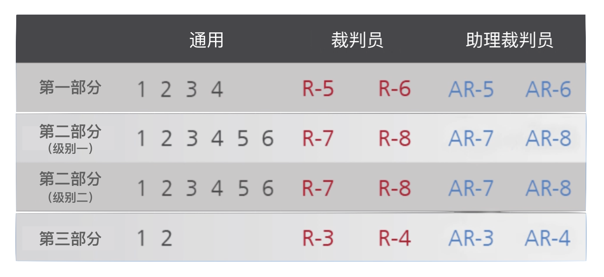

# 🏃 [FIFA 11+（裁判员版）](https://zzzxj12138.github.io/Eleven_zh/)

“FIFA&reg; 11+ 裁判员伤病预防项目” 由国际专家组根据 “FIFA&reg; 11+ 伤病预防项目” 以及裁判员特有的伤病情况进行开发，形成一套完整的热身方案，应当取代训练前的常规热身活动。

## 💡 《FIFA 11+（裁判员版）》结构

《FIFA 11+（裁判员版）》分为三个部分，共 18 项练习，应在每次训练开始时按照指定顺序进行。

这些练习侧重于裁判员和助理裁判员的特定活动模式。

<figure align="center">
    
</figure>

**✅ [第一部分](https://zzzxj12138.github.io/Eleven_zh/Part_1/index.html)**：跑动练习

**✅ [第二部分](https://zzzxj12138.github.io/Eleven_zh/Part_2/index.html)**：针对性练习，重点锻炼核心力量、腿部力量、平衡性、力量增强以及灵活性。每项练习都有两个不同难度的动作。

**✅ [第三部分](https://zzzxj12138.github.io/Eleven_zh/Part_3/index.html)**：跑动练习

该训练的关键在于使用正确的技术动作完成所有练习。要充分关注正确的身体姿势和良好的身体控制，如直腿对齐、膝盖与脚尖的相对位置、落地缓冲等。
